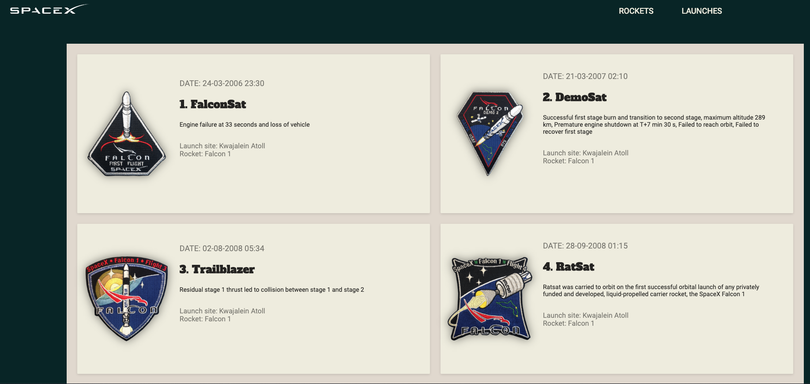

# 🚀 SpaceX's info website 

App made with React and GraphQL to fetch data from Open Source REST API.

#### 🕹️ Demo https://quiet-tundra-79147.herokuapp.com/

## ✋ Before Getting Started You Should…

    1. Have some React knowledge.
    2. Have some GraphQL and Apollo knowledge.
    3. Have some Node.js and Express knowledge.
    2. Have npm or yarn (or other package manager) set up on your computer.
    3. Have Node 8.10 or higher installed in computer.

## ⭐ Getting Started

These instructions will get you a copy of the project up and running on your local machine for development and testing purposes. 

### 👉 Clone the repository to your machine

You can use git or download it directly from github

### 👉 Get the dependencies

Open your cloned folder. Then, using your favorite package manager get the dependencies.

Example using npm:

    $ npm install
    $ cd client && npm install

### 👉 Available Scripts

In the project directory, you can run:

#### - Run server & client (:3000 & :5000): 
    $ npm run dev  

#### - Server only (:5000):
    $ npm run server

#### - Client only (:3000):
    $ npm run client 

#### - Build for production (Builds into " ./public "):
    $ cd client && npm run build

#### - Graphiql - http://localhost:5000/graphql

## 🏗️ Built With

#### Client:

- [React](https://reactjs.org/docs/getting-started.html) - The web framework used.
- [React-router](https://reacttraining.com/react-router/) - Navigation.
- [GraphQL](https://graphql.org/) - Query language for the API.
- [Apollo](https://www.apollographql.com/) - Apollo client.

#### Server:
- [Node.js](https://nodejs.org) - Backend language.
- [Express](https://expressjs.com/) - web framework for Node.js.
- [Axios](https://github.com/axios/axios) - HTTP client.
- [GraphQL](https://graphql.org/) - Query language.

## 🖋️ Author

- **Efren Sanchez** - *Initial work* - [EfrenSanchez](https://github.com/EfrenSanchez)

## ©️ License

This project is licensed under the MIT License 